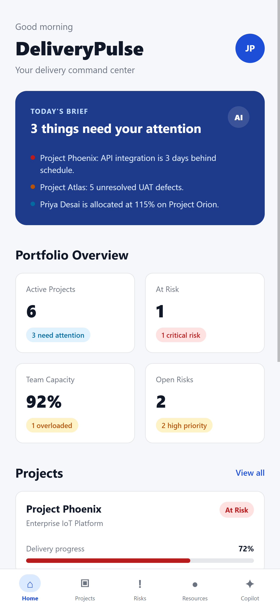
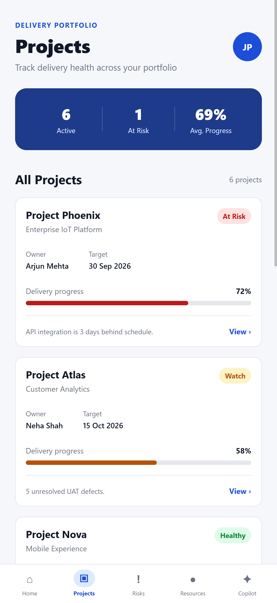
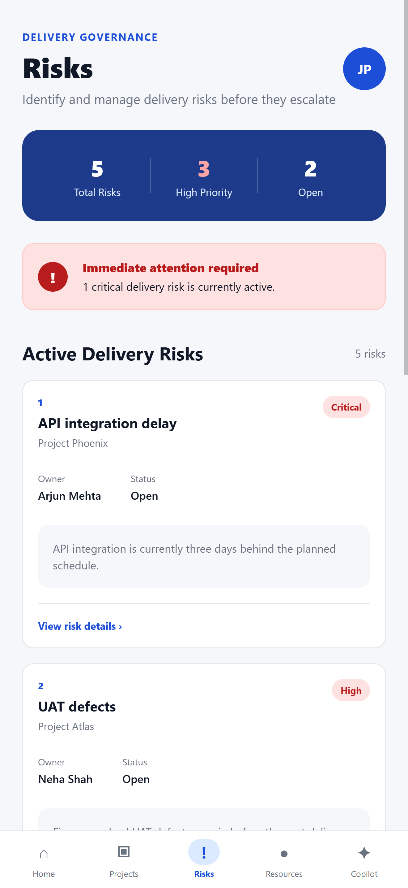
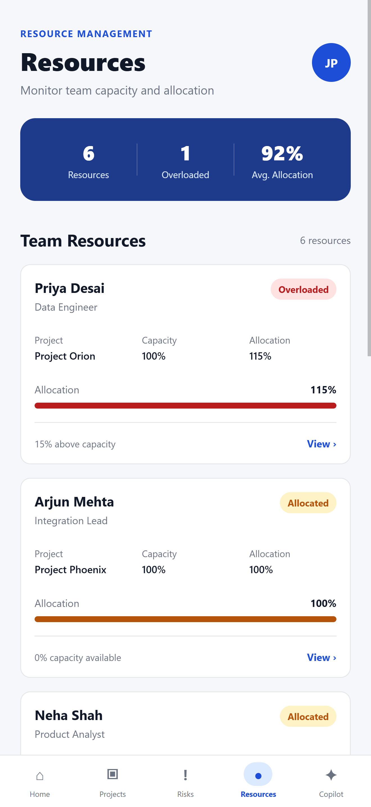
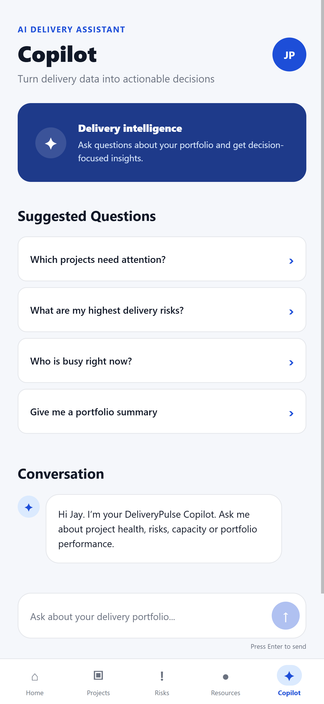

# DeliveryPulse

## AI-Powered Project Delivery Intelligence

DeliveryPulse is a portfolio-level project delivery management application designed to help delivery managers identify project exceptions, delivery risks, capacity constraints, and management priorities from a single interface.

Rather than focusing only on project tracking, DeliveryPulse is built around a simple question:

> **Where does management attention need to go next?**

The application combines portfolio data with AI-powered delivery analysis to provide decision-focused insights across projects, risks, resources, and delivery health.

---

## Key Features

### Portfolio Dashboard

Provides a management-level view of:

- Active projects
- Projects requiring attention
- Portfolio delivery progress
- Open delivery risks
- High-priority risks
- Resource capacity concerns

The dashboard is designed around management by exception — highlighting areas requiring attention rather than simply presenting project data.

### Project Management

Monitor project-level information including:

- Delivery status
- Progress
- Target date
- Project owner
- Delivery risk
- Management assessment

Projects are classified as **Healthy**, **Watch**, or **At Risk**.

### Risk Management

Centralized delivery-risk tracking covering:

- Risk severity
- Risk status
- Project association
- Risk owner
- Description
- Recommended management action

### Resource Capacity

Monitor resource allocation and identify capacity pressure across the portfolio.

DeliveryPulse highlights current allocation, available capacity, overloaded resources, project assignments, and capacity concerns.

### Daily Delivery Brief

The Daily Delivery Brief converts current portfolio conditions into a short list of management priorities.

Instead of another dashboard, it answers:

> **What needs my attention today?**

### AI Delivery Copilot

The DeliveryPulse Copilot allows managers to ask natural-language questions about their portfolio.

Examples:

- Which project needs my intervention?
- Which projects need attention?
- What are my highest delivery risks?
- Who is overloaded?
- Give me a portfolio summary.

The Copilot uses current delivery context to generate management-focused analysis and recommended actions.

---

## Application Screens

### Dashboard



### Projects



### Project Details


### Risks



### Resources



### Daily Delivery Brief


### AI Delivery Copilot



---

## Technology Stack

### Frontend

- React Native
- Expo
- TypeScript
- Expo Router

### Backend

- Node.js
- Express
- TypeScript
- REST APIs

### Data

- PostgreSQL
- Prisma ORM

### AI

- Google Gemini
- `@google/genai`

### Development

- Git
- GitHub
- VS Code

---

## Architecture

DeliveryPulse uses a client-server architecture:

```text
React Native / Expo
        |
        | REST API
        v
Node.js / Express
        |
        +-------------------+
        |                   |
        v                   v
   PostgreSQL          Google Gemini
   Prisma ORM            AI API
```

The mobile application consumes portfolio information through backend REST APIs.

PostgreSQL and Prisma provide structured project, risk, and resource information.

The backend also integrates with Google Gemini to provide AI-powered delivery analysis.

For additional information, see:

[Architecture Documentation](docs/ARCHITECTURE.md)

---

## Project Structure

```text
DeliveryPulse/
│
├── src/
│   ├── app/
│   ├── components/
│   ├── data/
│   ├── services/
│   └── theme.ts
│
├── server/
│   ├── prisma/
│   └── src/
│
├── docs/
├── screenshots/
├── package.json
└── README.md
```

---

## Running the Project

### Prerequisites

- Node.js
- npm
- PostgreSQL

### Install Frontend Dependencies

From the project root:

```bash
npm install
```

### Install Backend Dependencies

```bash
cd server
npm install
```

### Environment Configuration

Backend environment variables are intentionally excluded from Git.

Configure the environment values required for:

- PostgreSQL database connection
- Gemini API access

### Prisma

From the `server` directory:

```bash
npx prisma generate
```

Run database migrations when required:

```bash
npx prisma migrate dev
```

Seed the demonstration portfolio:

```bash
npm run prisma:seed
```

### Start Backend

From the `server` directory:

```bash
npm run dev
```

### Start DeliveryPulse

From the project root:

```bash
npx expo start
```

For web:

```bash
npx expo start --web
```

---

## Example AI Use Case

A delivery manager can ask:

> **Which project needs my intervention?**

DeliveryPulse can evaluate portfolio context including:

- Project health
- Delivery progress
- Open risks
- Risk severity
- Resource allocation
- Delivery dependencies

The Copilot then identifies the highest-priority exception, explains the supporting facts, and recommends management actions.

This demonstrates how generative AI can be applied as an intelligence layer over structured project-delivery data rather than operating as a standalone chatbot.

---

## Design Philosophy

DeliveryPulse is built around **management by exception**.

A delivery manager should not need to inspect every project, risk, and resource every morning.

The system should help answer four questions:

1. What is happening?
2. What needs attention?
3. Why does it matter?
4. What should management do next?

---

## Documentation

- [Architecture](docs/ARCHITECTURE.md)
- [Features](docs/FEATURES.md)
- [AI Copilot](docs/AI-COPILOT.md)

---

## Project Status

Portfolio demonstration project.

The current implementation demonstrates an end-to-end workflow across project portfolio management, delivery risks, resource capacity, daily delivery intelligence, backend APIs, persistence, and AI-assisted portfolio analysis.

---

## Author

**Jay Parikh**

Project & Delivery Management | AI & Digital Transformation

Website: jay-parikh.com

GitHub: @jaynparikh
